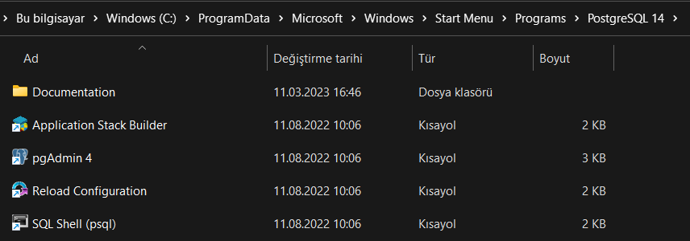
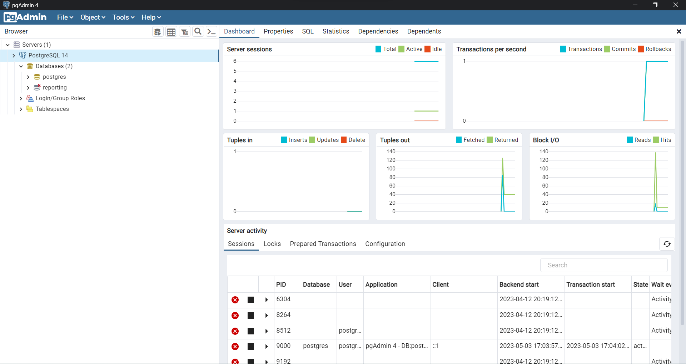
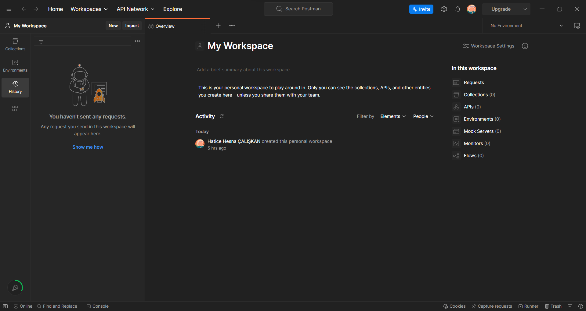

# Assignment Week1
## Gerekli Kurulumların Yapılması 
Simpra .Net Bootcamp'inin ilk haftasının ödevi olarak eğitim boyunca kullanılacak olan teknolojilerin kurulumu verildi. Repo içerisinde bir adet README dosyası, bir adet de kurulumların yapıldığına dair ekran çıktıları yer alan " week1hm_installation_of_requirements " adlı klasörü barındırıyor.
<ol> 
<li><h2>Veritabanı Kurulumları:</h2></li>
<ol>
<li> MSSQL Server</li>

  

<li> PostgreSQL(Docker üzerine veya bilgisayarınıza) </li>

  
</ol>
<li><h2>Veritabanı yönetim aracı kurulumları:</h2></li>
<ol>
<li> MSSQL Managment Studio</li>

  

<li> PgAdmin4 veya DBeaver </li>

  
</ol>
<li><h2>Diğer uygulamalar:</h2></li>
<ol>
<li> Postman</li>

  

<li> Docker (Sonraki haftalarda kullanılacak) </li>

  
</ol>

